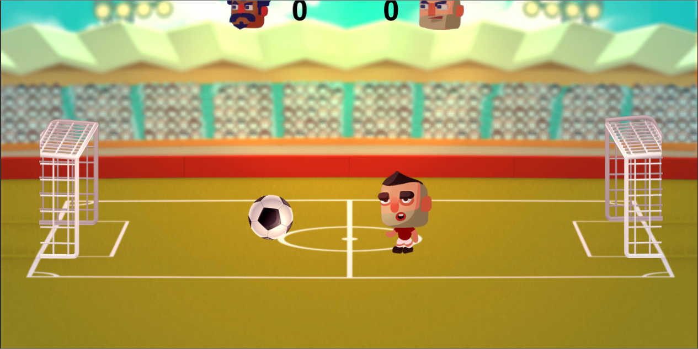
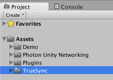

# Photon TrueSync Manual

## Summary

**TrueSync** is a multiplayer lockstep system for Unity built on top of Photon Network. 

In TrueSync, client machines exchange only the input generated by their respective players, and the simulation happens in lockstep on across clients, greatly reducing bandwidth requirements, and allowing complex 

It includes a custom physics engine and other classes to help the developer keep the simulation deterministic across machines.

## 1 - Getting Started

basic concepts (lockstep, ticks, input, determinism)
Lockstep is a technique to permit different machines to 

TrueSync includes some demo projects with full source code that can be used as a starting point to creating you own deterministic multiplayer game.

 The Kicking-Heads TrueSync sample game (sources for this and other demos are bundled with TrueSync for reference).

### Installation

If you got TrueSync as a zip file, decompress it and open the expanded folder as a Unity project. If you got the .unitypackage file, import it in your Unity game project to have access to TrueSync features.


TrueSync project files (game demos, bundled PUN and TrueSync folder which holds some basic gameobject prefabs).

TrueSync includes the latest version of Photon Unity Network (PUN), so you don't need to download it as a separate package, but you need to register for the Photon Cloud service and get an App-id key from the official website at http://photonengine.com.

### PUN setup

TrueSync not only includes, but actually depends on PUN to synchronize gameplay over the internet, so a game section can only happen for a group of players connected a single photon room. In the included sample projects, there's a basic code showing how to use PUN to connect your game to the photon network, create/join a room, and starting the TrueSync-managed gameplay section.


Location of the Photon setup prefab, where the developer must insert its own AppID key obtained from the Photon Cloud website.

If you correctly registered an app on photon, and inserted its appID into your projects photon setup file, you're ready to test 

The following sections will introduce you to the basic concepts and features of TrueSync. 

## 2 - TrueSync architecture

A TrueSync game must have all of its gameplay simulation controlled by TrueSync's game loop, so we can guarantee that the simulation will advance equally in all of the player's machines.

To accomplish this goal, the developer has to rely in TrueSync's version of the input and update callbacks instead of standard Unity's game loop, which is not guaranteed to work in sync on different machines. The developer also has to guarantee that the game's simulation is deterministic, meaning all code paths will always work the same, given the same input. We'll discuss more on this subject later in this quick reference manual.

If the game includes physics simulation, it's mandatory to use TrueSync's included physics engine instead of the standard PhysX engine bundled with Unity, which is not deterministic. TrueSync's physics engine works very similarly to Unity's PhysX components, and will also be discussed later in this document.

We'll now introduce the basic prefabs and extensible Unity behaviours that come packed with TrueSync to help developers create deterministic simulations for multiplayer games.

### TrueSyncManager

The *TrueSync* component controls a gameplay section and makes sure the simulation happens in sync with the other machines in the same room. There must be a single game object in the gameplay scene with this components attached to it.

There is a prefab included in TrueSync's package that contains both the *TrueSync* and *PhysicsWorldManager* (we'll discuss this in section 3) components attached to it. All demo games use this prefab.

The developer may set the input latency (*SyncWindow* attribute) based on a expected network latency for the players (TrueSync will not adjust this value in realtime, to avoid messing with the gameplay experience) We recomend reading section 4, which explains how TrueSync implements the **rollback** concept to dynamically hide latency by gessing user input (and correcting when guess was wrong).

To start a TrueSync-managed section, make sure the game client is connected to a photon room and load a scene or instantiate a game object with the TrueSync component attached. When *Start()* is called at the TrueSync component by Unity, it looks for the connected players and starts the synced gameplay section. A TrueSync section happens in two steps: player objects instantiation and synced input-update cicles.

### Player objects Instantiation

In a multiplayer game, it is expected that each player has control of one or more objects. In TrueSync, we use the concept of game object ownership, so every gameplay object must either be controlled by one of the players, or by the general game simulation (deterministic physics engine or custom code).

To instantiate a player object, create a game object prefab with a custom behavior that inherits from TrueSyncBehavior and drag it to the appropriate slot into the TrueSync component. TrueSync will instantiate one clone of the prefab for each player connected to the room, and take care of delivering the correct player input during each of these objects synced update cicle.

### TrueSyncBehavior

A TrueSyncBehavior have two important callbacks that can be implemented: 
- *SyncedInput()* is called only on the local copies of player-controlled objects to collect the local player input and register it in TrueSync;
- *SyncedUpdate()* is called in all objects that have a TrueSyncBehavior attached and should be used to update the game object (never use Unity's FixedUpdate or Update to simulate gameplay objects);

Calls to *SyncedInput()* are used to collect and buffer the input made in real-time by the local player. This input is buffered (to wait for the set input latency) and sent to all other machines in the photon room.

If a game object is player-controlled, accesses to *TrueSyncInput* made inside *SyncedUpdate()* will return input values given by the correspondent player. Scene objects that are not player-controlled may use *SyncedUpdate()* to advance the simulation deterministically without the need to lookup for input values.

### Input determinism

```cs
TrueSyncInput.GetInput();
```

Input determinism (from Unity's Input to TrueSyncInput)
Player out-of-sync situations

## 3 - TrueSync Physics Engine

basic concepts (determinism, 
Basic prefabs
Components
Colliders
Rigidbody
Joints
Keeping simulation deterministic
Forces, velocity, etc
Extras (FP class, RandomNumber, etc);

## 4 - Rollback engine

basic concepts
physics state rollback

callbacks
custom state tracking

## 5 - Extras

Stats, Physics Checksum, replays (separate chapter)
